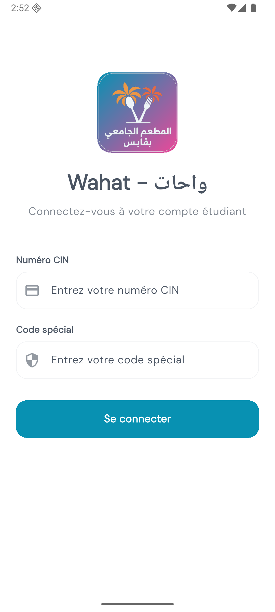
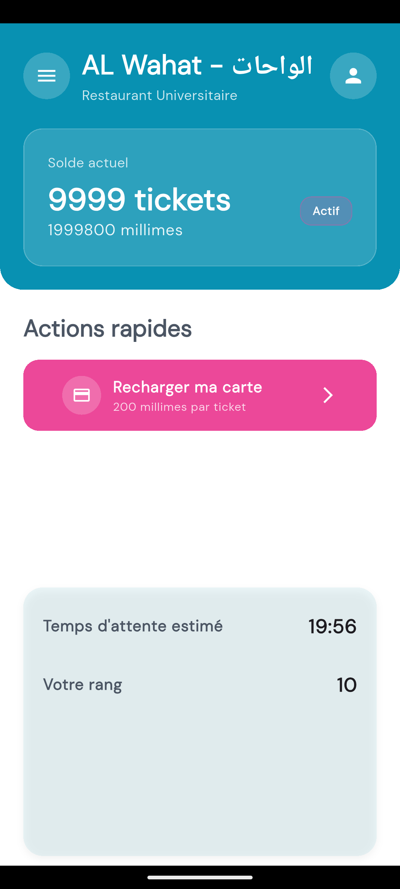

# WahatApp - Application mobile pour la gestion d'un restaurant universitaire 🍽️

Une application mobile moderne développée en Flutter pour faciliter et numériser l'obtention des repas au restaurant universitaire pour les étudiants tunisiens.

## 📱 Aperçu

WahatApp permet aux étudiants de gérer facilement leur carte restaurant universitaire avec une interface intuitive et moderne. L'application offre la consultation du solde en temps réel, la recharge de carte via paiement bancaire, et un historique complet des transactions.

## ✨ Fonctionnalités

### 🏠 Écran Principal
- **Consultation du solde** : Affichage en temps réel du nombre de tickets disponibles
- **Équivalent en millimes** : Conversion automatique (200 millimes = 1 ticket)
- **Actions rapides** : Accès direct à la recharge et à l'historique

### 💳 Système de Recharge
- **Options prédéfinies** : Recharge rapide de 1 ou 5 tickets
- **Montant personnalisé** : Choix libre du nombre de tickets
- **Paiement sécurisé** : Formulaire de carte bancaire avec validation
- **Confirmation** : Message de succès ou d'échec

### 📊 Historique des Transactions
- **Liste complète** : Toutes les transactions (recharges et utilisations)
- **Statuts détaillés** : Complété, en attente, échoué
- **Statistiques mensuelles** : Résumé des dépenses par mois


## 🎨 Design

- **Interface moderne** : Material Design 3 - Google's latest open source design system
- **Palette de couleurs** : Cyan (#0891B2) et Rose (#EC4899)
- **Typographie** : Google Fonts DM Sans pour une lisibilité optimale
- **Responsive** : Adapté à tous les formats d'écran mobile
- **Animations fluides** : Transitions et feedback visuels

## 🛠️ Technologies Utilisées

- **Framework** : Flutter (>=3.10.0)
- **Langage** : Dart
- **UI** : Material Design 3
- **Fonts** : Google Fonts (DM Sans)
- **Icons** : Material Icons + Cupertino Icons
- **Architecture** : Clean Architecture avec séparation des responsabilités

## 📦 Dépendances

```yaml
dependencies:
  flutter:
    sdk: flutter
  cupertino_icons: ^1.0.2
  google_fonts: ^6.1.0
  flutter_svg: ^2.0.9
  mask_text_input_formatter: ^2.9.0
  firebase_core: ^4.0.0
  firebase_auth: ^6.0.1
  cloud_firestore: ^6.0.0
  firebase_database: ^12.0.0
```

## 🚀 Installation

### Prérequis
- Flutter SDK (>=3.10.0)
- Dart SDK
- Android Studio / VS Code
- Émulateur Android/iOS ou appareil physique

### Étapes d'installation

1. **Cloner le repository**
```bash
git clone https://github.com/Abdelwahebbch/university_restaurant_app.git
cd university_restaurant_app
```

2. **Installer les dépendances**
```bash
flutter pub get
```

3. **Lancer l'application**
```bash
flutter run
```

## 📱 Captures d'écran

| Login Screen | Home Screen | Profile Screen |
|----------------|----------|------------|
|  |  |  |

## 🏗️ Structure du Projet

```
lib/
├── main.dart                
├── models/
│   ├── Student_model.dart
│   └── transaction.dart     
├── screens/
│   ├── about_screen.dart
│   ├── history_screen.dart
│   ├── home_screen.dart
│   ├── login_screen.dart
│   ├── profile_screen.dart      
│   └── splash_screen.dart  
├── theme/
│   └── app_theme.dart       
└── widgets/
    ├── balance_card.dart
    ├── failure_message.dart
    ├── information_card.dart 
    ├── quick_actions.dart   
    ├── recharge_modal.dart  
    ├── payment_modal.dart   
    ├── success_message.dart  
    └── transaction_item.dart 
```

## 💰 Système de Paiement

- **Prix fixe** : 200 millimes par ticket
- **Options de recharge** : 1, 5, ou nombre personnalisé de tickets (<= 100)
- **Paiement sécurisé** : Formulaire de carte bancaire avec validation connecter avec l'API de KONNECT
- **Confirmation** : Feedback immédiat après paiement

## 🔧 Configuration

### Variables d'environnement
Créez un fichier `.env` à la racine du projet :

```env
PAYMENT_API_URL=https://api.payment-provider.com
API_KEY=your_api_key_here
```

### Configuration Firebase 

1. Ajoutez `google-services.json` dans `android/app/`
2. Ajoutez `GoogleService-Info.plist` dans `ios/Runner/`

## 🧪 Tests

```bash
# Tests unitaires
flutter test

# Tests d'intégration
flutter test integration_test/
```

## 📈 Roadmap

- [ ] Notifications push pour les recharges
- [ ] Mode sombre
- [ ] Support multilingue (Arabe/Français/Anglais)
- [ ] Intégration avec l'API ClicToPay

## 🤝 Contribution

Les contributions sont les bienvenues ! Veuillez suivre ces étapes :

1. Fork le projet
2. Créez une branche pour votre fonctionnalité (`git checkout -b feature/AmazingFeature`)
3. Committez vos changements (`git commit -m 'Add some AmazingFeature'`)
4. Push vers la branche (`git push origin feature/AmazingFeature`)
5. Ouvrez une Pull Request
<!--
## 📄 Licence

Ce projet est sous licence MIT. Voir le fichier [LICENSE](LICENSE) pour plus de détails.
-->
## 👥 Équipe

- **Développeur Principal** : [Abdelwaheb Bouchahwa](https://github.com/Abdelwahebbch)
<!-- - **Designer UI/UX** : [Nom Designer](https://github.com/designer-username)-->

## 📞 Support

Pour toute question ou problème :

- 📧 Email : bouchahwaabdelwaheb@iee.org

<!--
## 🙏 Remerciements

- Université de Gabes pour le partenariat
- Communauté Flutter pour les ressources
- Étudiants testeurs pour leurs retours
-->
---

**Wahat App** - Simplifier la vie étudiante, un repas à la fois ! 🎓✨
